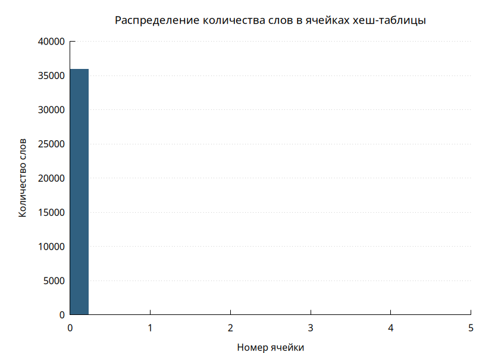
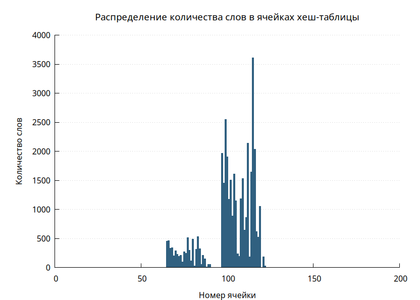
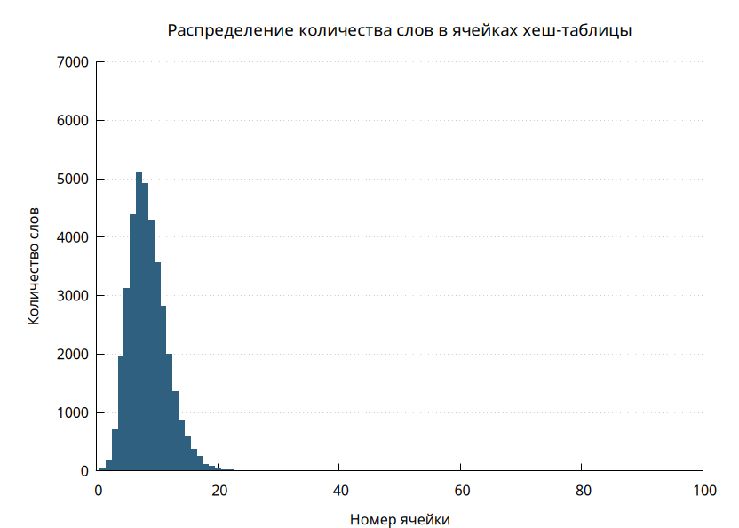
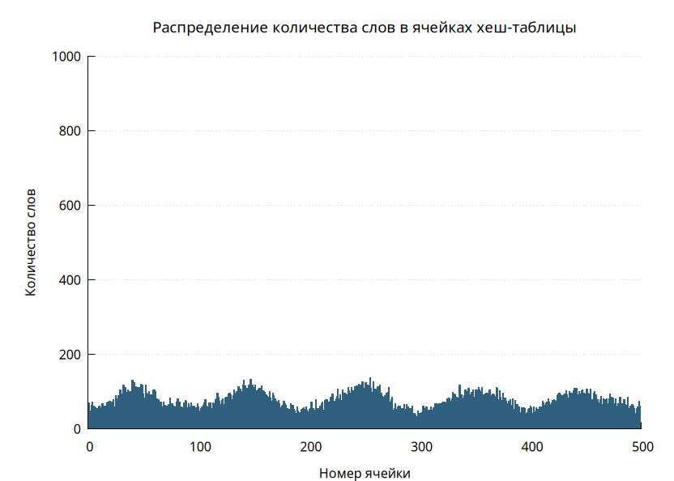
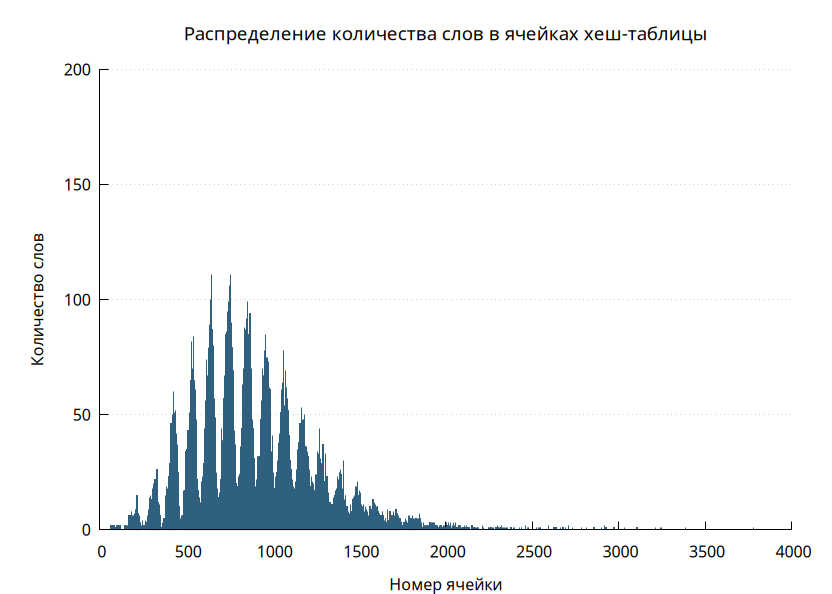
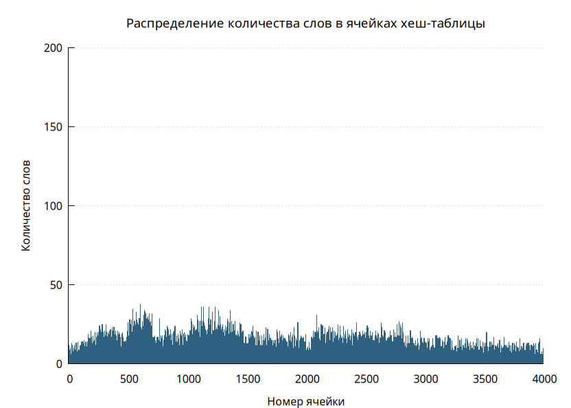
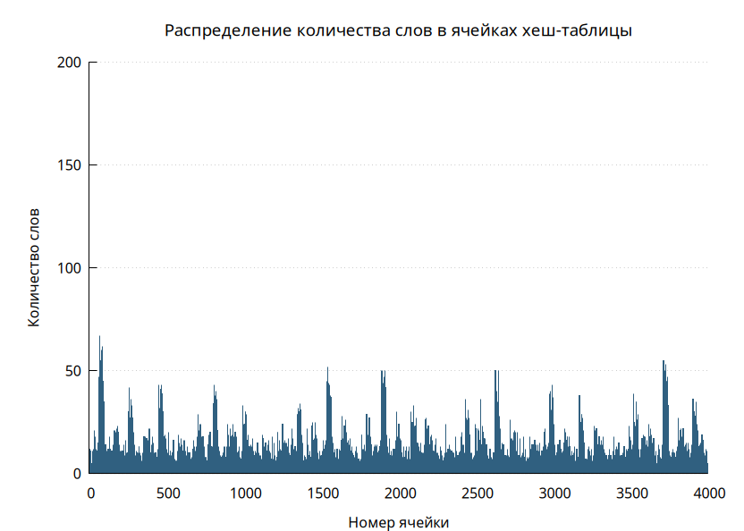
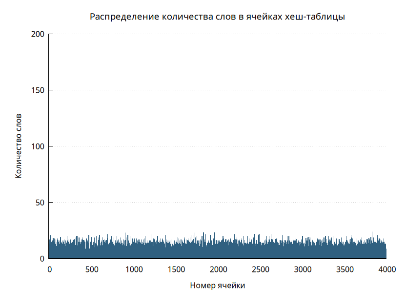

# Хеш-таблица

# Часть 1. Исследование распределений различных хеш-функций

<p style="font-size: 20px;">Количество слов: 36535</p>
<p style="font-size: 20px;">Размер хеш-таблицы: 4000</p>
<p style="font-size: 20px;">Load factor: ~9.1</p>

## 1) Простая хеш-функция

<p style="font-size: 20px;">Принцип работы: Кладёт любой элемент в нулевую ячейку.</p>


## 2) ASCII-код первой буквы

<p style="font-size: 20px;">Принцип работы: Кладёт элемент в ячейку с индексом, равным ASCII коду первой буквы слова.</p>



## 3) Длина слова

<p style="font-size: 20px;">Принцип работы: Кладёт  элемент в ячейку с индексом, равным длине слова.</p>



## 4) Сумма ASCII-кодов букв

<p style="font-size: 20px;">Принцип работы: Кладёт элемент в ячейку с индексом, равным сумме ASCII-кодом букв слова.</p>
<p style="font-size: 20px;">Для 500 ячеек:</p>



<p style="font-size: 20px;">Для 4000 ячеек:</p>



## 5) Циклический сдвиг влево + XOR

<p style="font-size: 20px;">Принцип работы: Начальное значение функции равно ASCII коду первой буквы слова. К нему применяется циклический сдвиг влево и XOR с ASCII-кодом следующей буквы. Повторяем шаг, пока не закончится слово.</p>



## 6) Циклический сдвиг вправо + XOR

<p style="font-size: 20px;">Принцип работы: Аналогично пункту 5, но сдвиг производится вправо.</p>



## 7) CRC32

<p style="font-size: 20px;">Принцип работы: Стандартный алгоритм CRC32.</p>




## Подсчёт дисперсии

<table style="width: 70%; border-collapse: collapse; font-size: 20px;">
  <tr>
    <th>Хеш-функция</th>
    <th>Дисперсия</th>
  </tr>
  <tr>
    <td>SimpleHashfunc</td>
    <td>333 700.0</td>
  </tr>
  <tr>
    <td>FirstAsciiHashFunc</td>
    <td>516.0</td>
  </tr>
    <tr>
    <td>WordLenHashFunc</td>
    <td>1138.0</td>
  </tr>
    <tr>
    <td>SumAsciiHashFunc</td>
    <td>19.3</td>
  </tr>
    <tr>
    <td>LeftShiftNXorHashFunc</td>
    <td>4.3</td>
  </tr>
    <tr>
    <td>RightShiftNXorHashFunc</td>
    <td>8.2</td>
  </tr>
    <tr>
    <td>Crc32</td>
    <td>2.9</td>
  </tr>
</table>

# Часть 2. Оптимизация хеш-таблицы

<p style="font-size: 20px;">Будем оптимизировать версию с хеш-функцией CRC32 и измерять время поиска 100 000 000 слов. Первая оптимизация - использование -О3 при компиляции:</p>

<table style="width: 70%; border-collapse: collapse; font-size: 20px;">
  <tr>
    <th>До оптимизации, c</th>
    <th>После оптимизации, c</th>
    <th>Коэффициент ускорения, %</th>
  </tr>
  <tr>
    <td>14.579 ± 0.004</td>
    <td>4.862  ± 0.003</td>
    <td>66.7</td>
  </tr>
</table>

## Оптимизация 1

<p style="font-size: 20px;">Произведём профилирование программы с помощью Callgrind.</p>


<p style="font-size: 20px;">Видим, что самая тяжелой является хеш-функция Crc32. Для её оптимизации используем интринсик _mm_crc32_u32. </p>

<p style="font-size: 20px;">Первоначальный вариант Crc32:</p>

```c
unsigned int Crc32 (const char * word)
{
    unsigned int res = 0;
    unsigned int len = (unsigned int) strlen (word);

    while (len--)
    {
        res ^= (unsigned int) *word;
        word++;
        for (int i = 0; i < 8; i++)
            res = (res >> 1) ^ ((res & 1) ? 0xedb88320 : 0);
    }

    return res % HASHTABLE_SIZE;
}

```

<p style="font-size: 20px;">После оптимизации:</p>

```c
unsigned int Crc32 (const char * word)
{
    unsigned int res = 0xFFFFFFFF;
    const unsigned int * ptr = (const unsigned int *) word;

    for (int i = 0; i < 8; i++)
        res = _mm_crc32_u32(res, ptr[i]);

    return res % HASHTABLE_SIZE;
}
```

<p style="font-size: 20px;">Произведём измерения:</p>

<table style="width: 70%; border-collapse: collapse; font-size: 20px;">
  <tr>
    <th>До оптимизации, c</th>
    <th>После оптимизации, c</th>
    <th>Коэффициент ускорения, %</th>
  </tr>
  <tr>
    <td>4.862 ± 0.003</td>
    <td>1.067 ± 0.001</td>
    <td>78.1</td>
  </tr>
</table>


<p style="font-size: 20px;">Проведём повторное профилирование:</p>


<p style="font-size: 20px;">Теперь самая тяжелая функция - strcmp. Заметим, что все слова влезают в 256 бит, значит, они влезают в переменную типа `__m256i`. Поэтому можем использовать интринсик _mm256_cmpeq_epi8 для сравнения строк.</p>

```c
int MyStrcmp (const char * string1, const char * string2)
{
    __m256i a = _mm256_loadu_si256((const __m256i *) string1);
    __m256i b = _mm256_loadu_si256((const __m256i *) string2);
    
    __m256i cmp = _mm256_cmpeq_epi8(a, b);
    int symbols_equ_mask = _mm256_movemask_epi8(cmp);

    return ~symbols_equ_mask;
}
```
<p style="font-size: 20px;">Произведём измерения:</p>

<table style="width: 70%; border-collapse: collapse; font-size: 20px;">
  <tr>
    <th>До оптимизации, c</th>
    <th>После оптимизации, c</th>
    <th>Коэффициент ускорения, %</th>
  </tr>
  <tr>
    <td>1.067 ± 0.001</td>
    <td>0.563 ± 0.001</td>
    <td>47.2</td>
  </tr>
</table>


<p style="font-size: 20px;">Проведём профилирование ещё раз. Видим, что вес наиболее тяжёлой неоптимизированной функции - 0.34%. Дальнейшие оптимизации не дадут достаточного эффекта, но в учебных целях попробуем ещё два вида оптимизаций.</p>

## Оптимизация 2

<p style="font-size: 20px;">Используем ассемблерную вставку:</p>

```c
unsigned int Crc32 (const char * word, int hashtable_size)
{
    unsigned int res = 0xFFFFFFFF;
    const unsigned int * ptr = (const unsigned int *) word;

    asm volatile (".intel_syntax noprefix;\n"
        "crc32 %0, DWORD PTR [%1];\n"
        "crc32 %0, DWORD PTR [%1+4];\n"
        "crc32 %0, DWORD PTR [%1+8];\n"
        "crc32 %0, DWORD PTR [%1+12];\n"
        "crc32 %0, DWORD PTR [%1+16];\n"
        "crc32 %0, DWORD PTR [%1+20];\n"
        "crc32 %0, DWORD PTR [%1+24];\n"
        "crc32 %0, DWORD PTR [%1+28];\n"
        ".att_syntax prefix;\n"
        : "+r" (res) 
        : "r"  (ptr)  
    );
 
    return res % hashtable_size;
}
```

<p style="font-size: 20px;">Произведём измерения:</p>

<table style="width: 70%; border-collapse: collapse; font-size: 20px;">
  <tr>
    <th>До оптимизации, c</th>
    <th>После оптимизации, c</th>
  </tr>
  <tr>
    <td>0.563 ± 0.001</td>
    <td>0.562 ± 0.001</td>
  </tr>
</table>

<p style="font-size: 20px;">В пределах погрешности оптимизация ничего не изменила.</p>

## Оптимизация 3

<p style="font-size: 20px;">Попробуем оптимизировать с помощью переписывания на ассемблере хеш-функцию SumAsciiHashFunc:</p>

```asm
default rel
global SumAsciiHashFunc

section .text

SumAsciiHashFunc:
        movsx   edx, byte [rdi]
        test    dl, dl
        je      .L4
        xor     eax, eax
.L3:
        add     rdi, 1
        add     eax, edx
        movsx   edx, byte [rdi]
        test    dl, dl
        jne     .L3
        xor     edx, edx
        div     esi
        mov     eax, edx
        ret
.L4:
        xor     edx, edx
        mov     eax, edx
        ret
```

<p style="font-size: 20px;">Произведём измерения:</p>

<table style="width: 70%; border-collapse: collapse; font-size: 20px;">
  <tr>
    <th>До оптимизации, c</th>
    <th>После оптимизации, c</th>
    <th>Коэффициент ускорения, %</th>
  </tr>
  <tr>
    <td>1.360 ± 0.001</td>
    <td>1.351 ± 0.001</td>
    <td>0.9</td>
  </tr>
</table>

# Вывод

<table style="width: 70%; border-collapse: collapse; font-size: 20px;">
  <tr>
    <th>Оптимизация</th>
    <th>Время, с</th>
    <th>Коэффициент ускорения относительно предыдущей версии, %</th>
    <th>Коэффициент ускорения относительно первой версии, %</th>
  </tr>
  <tr>
    <td>-</td>
    <td>4.862 ± 0.003</td>
    <td>-</td>
    <td>-</td>
  </tr>
  <tr>
    <td>crc32</td>
    <td>1.067 ± 0.001</td>
    <td>78.1</td>
    <td>78.1</td>
  </tr>
    <td>strcmp</td>
    <td>0.563 ± 0.001</td>
    <td>47.2</td>
    <td>88.4</td>
  </tr>
</table>

<p style="font-size: 20px;">Получаем итоговое ускорение 88.4%.</p>
